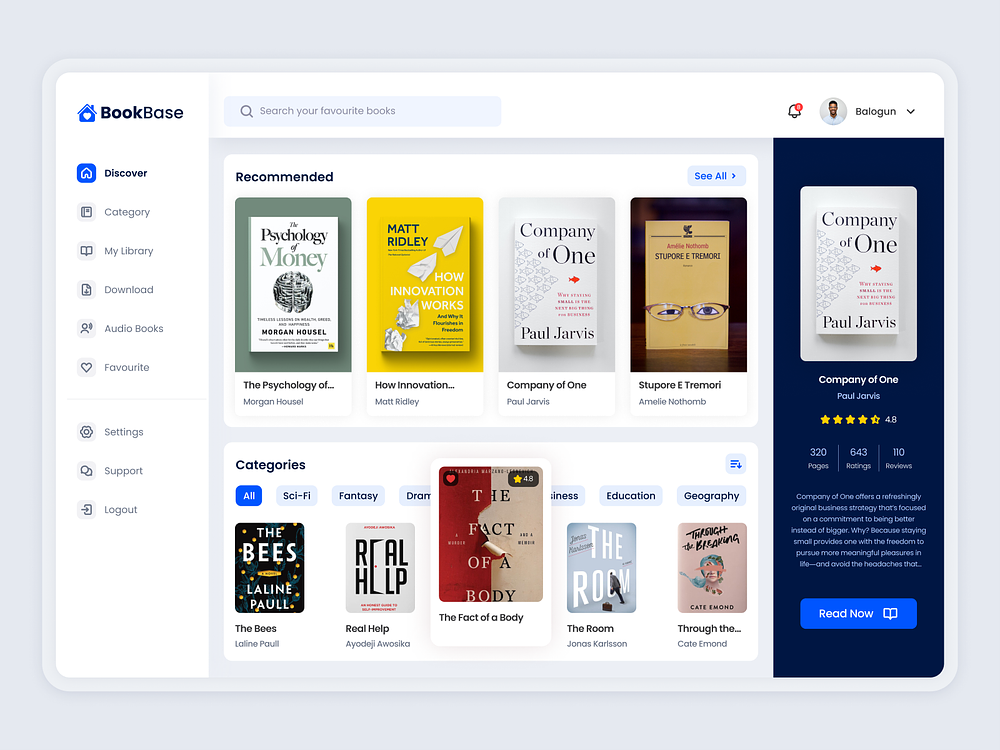

<a>
  <h1 align="center">Next.js and Supabase Starter Kit</h1>
</a>

<br/>

If you wish to just develop locally, [follow the steps below](#clone-and-run-locally).

## Clone and run locally

1. You'll first need a Supabase project which can be made [via the Supabase dashboard](https://database.new)

2. Use `cd` to change into the app's directory

   ```bash
   cd read-realm
   ```

3. Rename `.env.local.example` to `.env` and update the following:

   ```
   NEXT_PUBLIC_SUPABASE_URL=[INSERT SUPABASE PROJECT URL]
   NEXT_PUBLIC_SUPABASE_ANON_KEY=[INSERT SUPABASE PROJECT API ANON KEY]
   DATABASE_URL=[INSERT SUPABASE CONNECTION STRING]
   ```

   Both `NEXT_PUBLIC_SUPABASE_URL` and `NEXT_PUBLIC_SUPABASE_ANON_KEY` can be found in [your Supabase project's API settings](https://app.supabase.com/project/_/settings/api)

4. You can now run the Next.js local development server:

   ```bash
   npm run dev
   ```

   The starter kit should now be running on [localhost:3000](http://localhost:3000/).

## More Supabase examples

- [Next.js Subscription Payments Starter](https://github.com/vercel/nextjs-subscription-payments)
- [Cookie-based Auth and the Next.js 13 App Router (free course)](https://youtube.com/playlist?list=PL5S4mPUpp4OtMhpnp93EFSo42iQ40XjbF)
- [Supabase Auth and the Next.js App Router](https://github.com/supabase/supabase/tree/master/examples/auth/nextjs)

## UI

Inpiration: BookBase - Digital Book Library Dashboard by [Kazeem Adebola Idris
](https://dribbble.com/pkaidris)


